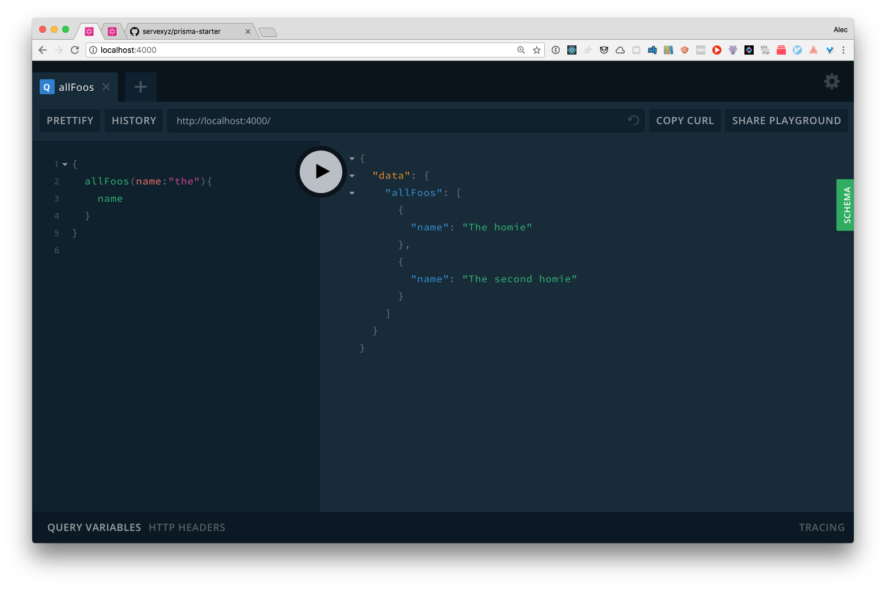
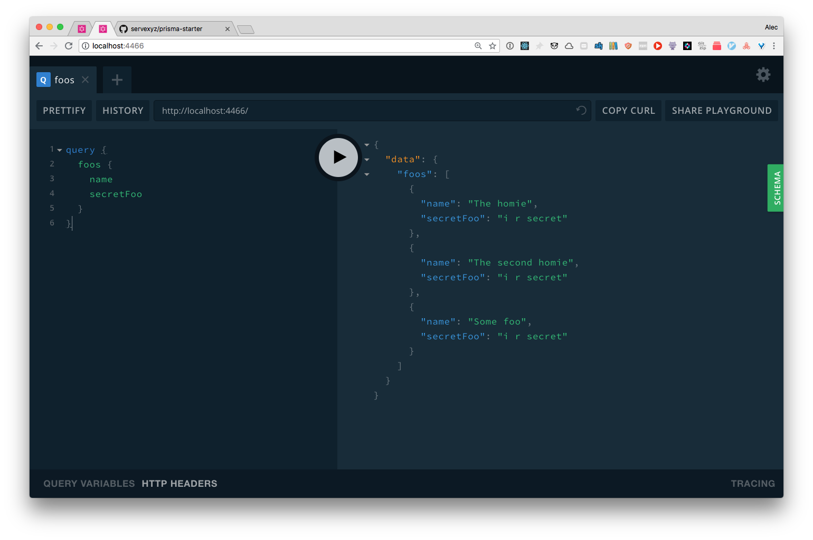
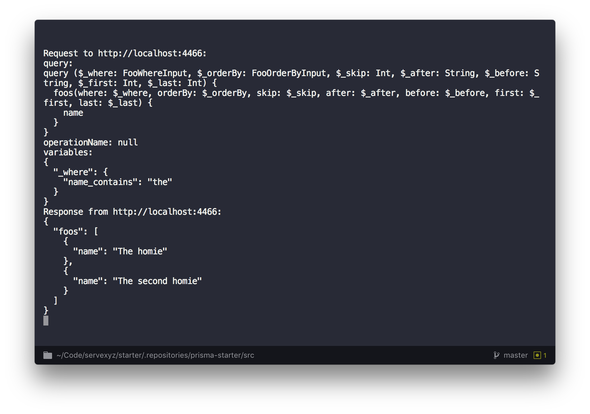

# Demo

<!-- TOC -->

- [Demo](#demo)
  - [Results](#results)
  - [Install](#install)

<!-- /TOC -->

### Results

**http://localhost:4000**

**http://localhost:4466**

**CLI Output**

### Install

**npm run docker:start:all**

**npm run docker:start:db**

